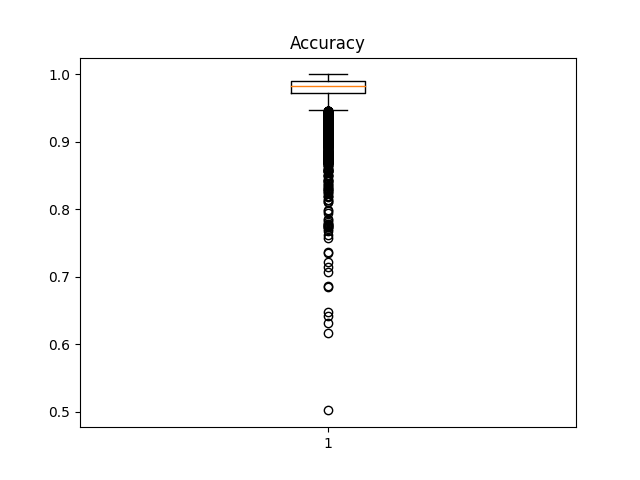
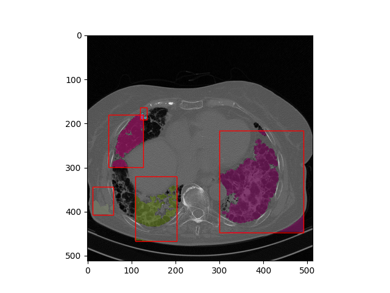

# Постановка задачи
На вход подается изображение с легкими. Необходимо обучить модель, которая способна распозновать легкие и строить их маску. На выход выводится изображение и маска легких

## Пример изображения поступающего на вход

## Пример выходных данных

# Алгоритм
## Подготовка изображения
Размерность изображения уменьшается в N раз по двум измерениям с помощью билинейной фильтрации

## Unet

Сеть содержит сверточную (слева) и разверточную части (справа). Сверточная часть похожа на обычную свёрточную сеть, он содержит два подряд свёрточных слоя 3×3, после которых идет слой ReLU и пулинг с функцией максимума 2×2 с шагом 2. Каждый шаг разверточной части содержит слой, обратный пулинг, который расширяет карту признаков, после которого следует свертка 2×2, которая уменьшает количество каналов признаков. После идет конкатенация с соответствующим образом обрезанной картой признаков из сжимающего пути и две свертки 3×3, после каждой из которой идет ReLU. Обрезка нужна из-за того, что мы теряем пограничные пиксели в каждой свёртке. На последнем слое свертка 1×1 используется для приведения каждого 64-компонентного вектора признаков до требуемого количества классов.

## ChanVese
[Описание алгоритма ChanVese](https://www.researchgate.net/publication/274120746_Chan-Vese_Segmentation)

# Результаты
Тренировка происходила на датасете с изображениями легких. Объем изображений для тренировки равняется 7400, из которых 15% использовалось в качестве валидационных данных. Было обучено 100 эпох. Для тестирования использовалось 4383 изображения.

## Примеры сегментированных изображений

## Измерения точности

### Пример изображений, на которых были выбросы в f1 оценке

## Время обучения и сегментирования
- Время обучения одной эпохи составляет 1 минуту
- Время предобработки изображения: 0.006c
- Время работы Unet модели: 0.007с
- Время работы алгоритма ChanVese: 0.51с

# Выводы
Благодоря использованию алгоритма ChanVese удалось упростить Unet модель всего до 3 уровней и в 4 раза меньшим числом слоев. Также за счет предварительного уменьшения размерности изображения удалось уменьшить число весов, которые находятся на кождом слое. В итоге удалось получить сократить время обучения и при этом получить тех же результатов точности.
